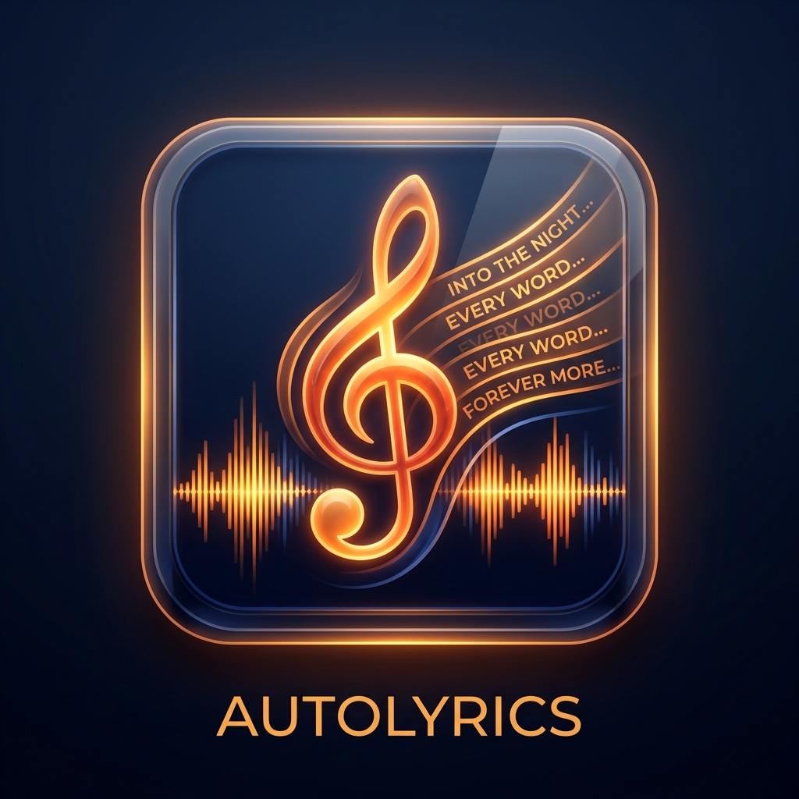

# mb_AutoLyrics

<p align="center">
  
</p>

[](https://github.com/treeturtlefall-arch/mb_AutoLyrics/actions/workflows/build.yml)
[](LICENSE)

[English](#english) | [日本語](#japanese)

---

<a name="japanese"></a>
## 日本語 (Japanese)

**mb_AutoLyrics** は、音楽プレイヤー [MusicBee](https://getmusicbee.com/) 用の歌詞自動取得プラグインです。
8つの歌詞ソース（日本語サイト5種 + 洋楽API2種 + オリコン）から多段探索を行い、取得した歌詞（プレーンテキストおよびタイムタグ付き同期歌詞/LRC）をMusicBeeのタグに自動保存します。

### 主な特徴

- **8プロバイダによる多段探索**: 邦楽から洋楽まで圧倒的なカバー率を実現。
- **同期歌詞 (LRC) 対応**: LRCLIB等からタイムタグ付きの同期歌詞（`[mm:ss.xx]`）を取得可能。MusicBee上で流れる歌詞を表示できます。
- **厳格マッチング**: 曲名・アーティスト名の類似度（レーベンシュタイン距離）を計算し、同名異アーティスト曲などの誤取得を徹底防止。
- **高速フォールバック & タイムアウト制御**: 各プロバイダに8秒タイムアウトを設け、一部サイトの遅延でMusicBeeがフリーズしない安全設計。
- **Cloudflare / ボット対策回避**: 内部で `curl.exe` と安全に連携し、TLSフィンガープリントによるブロックを回避。
- **設定パネル**: MusicBeeの環境設定からプロバイダごとのON/OFF、類似度閾値（50〜100%）、同期歌詞の優先設定をグラフィカルに変更可能。
- **安全設計**: プラグインが直接オーディオファイルを書き換えることはなく、MusicBee本体の正規APIを通じて安全に保存されます。

### 探索プロバイダ一覧

| 順位 | プロバイダ | 主な対象 | 形式 | 備考 |
|---|---|---|---|---|
| 1 | **歌詞ナビ** | 邦楽 | 通常 | 3世代のHTML構造自動フォールバック |
| 2 | **うたてん** | 邦楽 | 通常 | ふりがな（ルビ）自動除去 |
| 3 | **J-Lyric** | 邦楽 | 通常 | 中間一致検索 & ルビ除去 |
| 4 | **歌ネット** | 邦楽 | 通常 | curl.exe 連携によるCloudflare回避 |
| 5 | **プチリリ** | 邦楽 | 通常 | CSRFトークン認証フロー |
| 6 | **LRCLIB** | 洋楽・邦楽 | **同期(LRC) / 通常** | 高速API、再生時間（曲長）照合対応 |
| 7 | **Genius** | 洋楽 | 通常 | search API + HTMLセクション抽出 |
| 8 | **オリコン** | 邦楽 | 通常 | Brave検索+永続キャッシュによるartistId解決 |

### インストール方法

1. [Releases](https://github.com/treeturtlefall-arch/mb_AutoLyrics/releases) から最新の `mb_AutoLyrics-vX.X.X.zip` をダウンロードします。
2. MusicBee を完全に終了します。
3. ZIP 内の `mb_AutoLyrics.dll` を、以下のフォルダにコピーします：
   ```text
   %APPDATA%\MusicBee\Plugins\
   ```
4. MusicBee を起動し、`編集` → `設定` → `プラグイン` を開き、「AutoLyrics」が有効になっていることを確認します。
5. `編集` → `設定` → `タグ(2)` → `歌詞` → `歌詞プロバイダ` にて、本プラグインの各プロバイダが有効になっていることを確認し、お好みの優先順位に並び替えます。

### 設定画面 / Configuration

MusicBee の `設定` → `プラグイン` → `AutoLyrics` → `設定`（`Preferences` -> `Plugins` -> `AutoLyrics` -> `Configure`）から以下を調整できます：
- **Lyric Providers**: 各プロバイダの有効 / 無効の切り替え
- **Title similarity (%)**: 照合時の許容類似度（デフォルト: 85%）
- **Artist similarity (%)**: 照合時の許容類似度（デフォルト: 85%）
- **Prioritize synced lyrics (LRC)**: タイムタグ付き同期歌詞が利用可能な場合に優先保存

設定内容は `%APPDATA%\MusicBee\AutoLyrics\settings.xml` に保存されます。

### CLIテスター (LyricsTester)

MusicBeeを起動せずに、コマンドラインから各プロバイダの取得結果をテストできます。

```powershell
# 全プロバイダで通常検索
.\LyricsTester.exe "米津玄師" "Lemon"

# 同期歌詞(LRC)を優先して検索
.\LyricsTester.exe "Adele" "Hello" --synced

# 特定のプロバイダのみテスト & デバッグ情報の表示
.\LyricsTester.exe "Marc Jordan" "I'm a Camera" --provider "Genius" --debug

# プロバイダ一覧の表示
.\LyricsTester.exe --list
```

### ビルド手順

```powershell
git clone https://github.com/treeturtlefall-arch/mb_AutoLyrics.git
cd mb_AutoLyrics
dotnet build mb_AutoLyrics.sln -c Release
dotnet test mb_AutoLyrics.sln
```
要件: .NET 8 SDK（`net48` を対象ビルド）。

---

<a name="english"></a>
## English

**mb_AutoLyrics** is a multi-source lyric retrieval plugin for [MusicBee](https://getmusicbee.com/).
It searches through 8 different lyric providers (Japanese sites + international sources like LRCLIB & Genius) in cascading order and automatically saves plain or synchronized (LRC) lyrics to your library.

### Features

- **8 Cascading Providers**: Exceptional coverage for both Japanese and International songs.
- **Synced Lyrics (LRC) Support**: Automatically retrieves timestamped synchronized lyrics (`[mm:ss.xx]`) from LRCLIB for seamless scrolling in MusicBee.
- **Strict Fuzzy Matching**: Prevents false matches using Levenshtein distance similarity scoring on titles and artists.
- **Fast Fallback & 8s Timeout**: Avoids UI freezes when a particular website is slow or unreachable.
- **Cloudflare Bypass**: Seamless integration with `curl.exe` to bypass TLS fingerprint blocking.
- **Configuration Panel**: Easily enable/disable providers and tweak similarity thresholds within MusicBee's Preferences.

### Installation

1. Download the latest `mb_AutoLyrics-vX.X.X.zip` from [Releases](https://github.com/treeturtlefall-arch/mb_AutoLyrics/releases).
2. Close MusicBee completely.
3. Copy `mb_AutoLyrics.dll` into:
   ```text
   %APPDATA%\MusicBee\Plugins\
   ```
4. Restart MusicBee, navigate to `Edit` -> `Preferences` -> `Plugins`, and verify that **AutoLyrics** is enabled.
5. In `Tags (2)` -> `lyrics` -> `providers`, prioritize the providers to your preference.

---

## Acknowledgements / 謝辞

本プロジェクトは、以下の先人たちの優れたプラグイン実装および調査成果を参考に、大幅な再設計・拡張を行って開発されました。心より感謝申し上げます。

- **[noriokun4649/mb_KashiNaviLyricsPlugin](https://github.com/noriokun4649/mb_KashiNaviLyricsPlugin)** (MIT License) by noriokun4649
- **[netsphere-labs/mb_PetitLyricsPlugin](https://github.com/netsphere-labs/mb_PetitLyricsPlugin)** by htsign
- **MusicBee Plugin API SDK** by Steven Mayall

## License / ライセンス

[MIT License](LICENSE)
